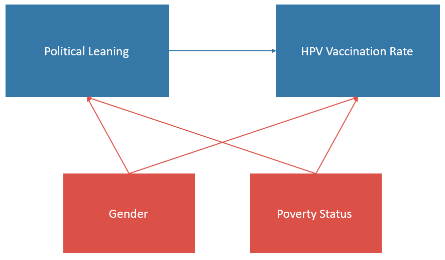

```{r setup, include=FALSE}
knitr::opts_chunk$set(echo = TRUE)
```

```{r libraries, include=FALSE}
# install.packages("pander")

library(tidyverse)
library(tidyr)
library(pander)
# any other libraries you want to load
```

### Question of interest

Human papillomavirus (HPV) is a group of related viruses that is predominantly associated with being the most common sexually transmitted infection. In fact, 79 million Americans are infected with HPV and the majority of sexually active people will be infected at some point in their lives. HPV has also been linked with various cancers such as reproductive cancers and oral/throat cancers. 

The HPV vaccine was first approved in 2006 for females and in 2009 for males. It has been shown to be safe and effective at protecting against cancer-causing serotypes of the virus, and the CDC recommends it for all adolescents aged 11-12. It is also one of the most controversial vaccines and is only considered mandatory in 3 states and the capital of the US (District of Columbia, Hawaii, Rhode Island, and Virginia). In the District of Columbia, Hawaii, and Rhode Island, this policy applies to both males and females. However, in Virginia, the mandate only applies to females. As such, vaccination rates across the US vary widely, although at the time this data was taken, Hawaii did not yet have a mandate in place. 

The main question of interest in this analysis is: How does state party affiliation affect HPV vaccination rates?

### Data
The data for this analysis comes from the [CDC's 2018 Adolescent HPV Vaccination Coverage Report](https://www.cdc.gov/vaccines/imz-managers/coverage/teenvaxview/data-reports/hpv/reports/2018.html). This report contains coverage data from all 50 states as well as 3 US territories and the United States as a whole. It also contains data on race, poverty level, and number of vaccine doses. For the sake of this analysis, I'll be concentrating on the data for teens who are up to date with their HPV vaccination. 

I have also incorporated state party affiliation data for 2018, sourced from [Gallup polls](https://news.gallup.com/poll/247025/democratic-states-exceed-republican-states-four-2018.aspx).


<!-- Briefly describe the data you plan to use to answer the question of interest.  Provide links to any publically available datasets. You can directly link to websites where your data is by including links in the following way: Here in the link to the [Johns Hopkins University homepage](https://www.jhu.edu/). -->

```{r dataFull, include=FALSE}
## Reading in the data
HPV_data <- read_csv("HPV_CONDENSED.csv", skip=2)

## Defining rates and sample size
HPV_rates <- HPV_data %>% select("Names", matches("2018"))
HPV_size <- HPV_data %>% select("Names", matches("SAMPLE SIZE"))


## Taking in column names
HPV_head1<- read_csv("HPV_CONDENSED.csv", n_max=1, col_names=FALSE)
# HPV_head1<-HPV_head1[1,][!is.na(HPV_head1[1,])]
HPV_head1 <- HPV_head1[,colSums(is.na(HPV_head1))<nrow(HPV_head1)]
## For example, you can get the first pieces using:
paste(rep(c("MF", "F", "M"), each=4), gsub(".*\\ ", "", HPV_head1), sep=".")

HPV_head2<- read_csv("HPV_CONDENSED.csv", skip=1, n_max=1, col_names=FALSE)
# HPV_head2<-HPV_head2[1,][!is.na(HPV_head2[1,])]
HPV_head2 <- HPV_head2[,colSums(is.na(HPV_head2))<nrow(HPV_head2)]

# remove spaces
gsub("\\ ", "", HPV_head2)

## create column names
colnames(HPV_rates)<- c("state", paste(rep(paste(rep(c("MF", "F", "M"), each=4), gsub(".*\\ ", "", HPV_head1), sep="."), times=rep(c(1,3,5,3), times=3)), gsub("\\ ", "", HPV_head2), "Rate", sep="."))

colnames(HPV_size)<- c("state", paste(rep(paste(rep(c("MF", "F", "M"), each=4), gsub(".*\\ ", "", HPV_head1), sep="."), times=rep(c(1,3,5,3), times=3)), gsub("\\ ", "", HPV_head2), "SampleSize", sep="."))

HPV_data <- HPV_rates %>% left_join(HPV_size)

```


```{r dataSimple, include=FALSE}
## Data for the US as a whole
US_data = HPV_data[55,]
## Data for individual states
HPV_data = HPV_data[-c(52,53,54,55),]

## reading in data on political leanings
politics_data <- read_csv("leanings detailed.csv", col_names=FALSE)
politics_data <- politics_data %>% select(state=X1, leaning=X3, demAdv=X2, general=X4) 

## joining data frames
HPV_data <- HPV_data %>% left_join(politics_data, by="state")

```

### Variables of interest

* **Outcome variable: State HPV vaccine coverage**
* **Primary predictor variable: Political leaning**
* **Possible confounders: Poverty, gender**
* **Potential effect modifiers:**

### Directed acyclic graph (DAG)


### Analysis plan
I will be using Poisson regression to analyze this dataset because the data are presented as rates. 

<!-- What type of basic analysis could you use to address your question of interest?  Linear regression because your outcome is continuous?  Logistic regression because your outcome is binary?  How will you control for confounding in your analysis?  This section may change and be updated later as you continue with your analysis. -->

### Preliminary graphs 
To get an overview of what the current status of vaccination is in the United States and some territories, this is a plot of the percentage of teens (ages 13-17) who are up to date with their HPV vaccines. 
```{r, echo=FALSE}
MFagePlot <- ggplot(HPV_data, aes(x=state, y=`MF.Age.13-17Years.Rate`)) +
  geom_bar(stat="identity",  fill="steelblue") +
  theme_minimal() + 
  geom_text(aes(label=`MF.Age.13-17Years.Rate`), vjust=-0.3, size=2) + 
  theme(axis.text.x = element_text(size=9, angle=90),
        axis.text.y = element_text(size=9)) +
  labs(title = "HPV Vaccination Rates by State", x = "State", y = "Rate") 

MFagePlot
```


I've also presented this information sorted by rate and shaded each state according to its party affiliation:
```{r, echo=FALSE}
HPV_data$stateSort <- factor(HPV_data$state, levels = HPV_data$state[order(HPV_data$`MF.Age.13-17Years.Rate`)])

# palette
pal <- c(
  "Strong Republican" = "#DC5147", 
  "Lean Republican" = "#E8C4C4",
  "Competitive" = "#c5c6c9",
  "Lean Democratic" = "#B4D4E4", 
  "Strong Democratic" = "#3578A8"
)

MFsortedPlot <- ggplot(HPV_data, aes(x=stateSort, y=`MF.Age.13-17Years.Rate`)) +
  geom_bar(stat="identity",  fill="steelblue") +
  theme_minimal() + 
  geom_text(aes(label=`MF.Age.13-17Years.Rate`), vjust=-0.3, size=2) + 
  theme(axis.text.x = element_text(size=9, angle=90),
        axis.text.y = element_text(size=9)) +
  labs(title = "HPV Vaccination Rates by State", x = "State", y = "Rate") + 
  scale_fill_manual(
    values = pal,
    limits = names(pal)
  )

MFsortedPoliticsPlot <- ggplot(HPV_data, aes(x=stateSort, y=`MF.Age.13-17Years.Rate`, fill=leaning)) +
  geom_bar(stat="identity") +
  theme_minimal() + 
  geom_text(aes(label=`MF.Age.13-17Years.Rate`), vjust=-0.3, size=2) + 
  theme(axis.text.x = element_text(size=9, angle=90),
        axis.text.y = element_text(size=9),
        legend.position = "bottom") +
  labs(title = "Ranked HPV Vaccination Rates by State with Party Affiliations", x = "State", y = "Rate", fill = "Political Leaning") + 
  scale_fill_manual(
    values = pal,
    limits = names(pal)
  )


MFsortedPoliticsPlot 
```

This graph reveals a potential relationship between political leaning and HPV vaccination rate. Some states to highlight are Rhode Island, District of Columbia, and Virginia as they have a HPV vaccine requirement to enter school as mentioned above. North Dakota interestingly is the only Republican state that has a rather high vaccination rate. This may be due to their program which sends annual postcards to parents of adolescents who have not yet received the vaccine. 


I also looked at the overall US vaccination rates by gender:
```{r, echo=FALSE}
overall_genderPlot <- ggplot(US_data) + 
  geom_bar(aes(x = "Overall", y = `MF.Age.13-17Years.Rate`), stat="identity", position="dodge") + 
  geom_bar(aes(x = "Female", y = `F.Age.13-17Years.Rate`), stat="identity", position="dodge", fill="#DC5147") + 
  geom_bar(aes(x = "Male", y = `M.Age.13-17Years.Rate`), stat="identity", position="dodge", fill="#3578A8") +
  theme_minimal() + 
  labs(title = "HPV Vaccination Rates Overall and by Gender", x = "", y = "Rate") +
  scale_y_continuous("Rate", expand = c(0, 0))
  # scale_fill_manual(values = c("#468189", "#9DBEBB"))

overall_genderPlot
```

The overall rate for females was just slightly higher (53.7%) than the overall rate for males (48.7%) and the national rate (51.1%)


Similarly, I looked at the vaccination rate for those at or above the poverty line compared with the rate for those below the poverty line:
```{r, echo=FALSE}

overall_povertyPlot <- ggplot(US_data) + 
  geom_bar(aes(x = "Overall", y = `MF.Age.13-17Years.Rate`), stat="identity", position="dodge") + 
  geom_bar(aes(x = "Not poor", y = `MF.Poverty.LivingAtorAbovePoverty.Rate`), stat="identity", position="dodge", fill="#DC5147") + 
  geom_bar(aes(x = "Poor", y = `MF.Poverty.LivingBelowPoverty.Rate`), stat="identity", position="dodge", fill="#3578A8") +
  theme_minimal() + 
  labs(title = "HPV Vaccination Rates Overall and by Poverty", x = "", y = "Rate") +
  scale_y_continuous("Rate", expand = c(0, 0)) +
  scale_x_discrete(limits = c("Not poor", "Poor", "Overall"))

overall_povertyPlot
```

Surprisingly, we see that vaccination rates for those living below the poverty line (57.1%) is higher than those living above (49.6%). This may be due to the work of programs such as Vaccines for Children, which help increase vaccine access for those who may not be able to typically afford it. 

### Analysis
```{r, include=FALSE}
## Analysis based on gender
HPV_data <- HPV_data %>% mutate(numMF = round(`MF.Age.13-17Years.Rate`*`MF.Age.13-17Years.SampleSize`),
                                numF = round(`F.Age.13-17Years.Rate`*`F.Age.13-17Years.SampleSize`),
                                numM = round(`M.Age.13-17Years.Rate`*`M.Age.13-17Years.SampleSize`),
                                ssMF = `MF.Age.13-17Years.SampleSize`,
                                ssF = `F.Age.13-17Years.SampleSize`,
                                ssM = `M.Age.13-17Years.SampleSize`)

# Shows the effect of political leaning on the overall rates
# The reference group is "Competitive"
# So we see that overall states that lean or are strong Dem have about a 20% increase in the vaccine rate compared to competitive states
# States that lean or are strong Republican have about a 10% decrease in the vaccine rate compared to competitive states
model_1 <- glm(numMF ~ leaning, data=HPV_data, offset=log(ssMF), family=poisson(link="log"))

model_1gen <- glm(numMF ~ general, data=HPV_data, offset=log(ssMF), family=poisson(link="log"))

expmodel <- as.data.frame(exp(model_1$coefficients))
exp(confint.default(model_1))

# Shows the effect of political leaning on the rates for females
# The reference group is "Competitive"
# For female vaccination rates, it looks like the effects are a little less strong
model_2 <- glm(numF ~ leaning, data=HPV_data, offset=log(ssF), family=poisson(link="log"))
model_2gen <- glm(numF ~ general, data=HPV_data, offset=log(ssF), family=poisson(link="log"))
exp(model_2$coefficients)
exp(confint.default(model_2))


# Shows the effect of political leaning on the rates for males
# The reference group is "Competitive"
# For males vaccination rates, it looks like the effects are a little stronger!
model_3 <- glm(numM ~ leaning, data=HPV_data, offset=log(ssM), family=poisson(link="log"))
model_3gen <- glm(numM ~ general, data=HPV_data, offset=log(ssM), family=poisson(link="log"))
exp(model_3$coefficients)
exp(confint.default(model_3))

```
I analyzed the impact of state political leanings on vaccination rate stratified by gender using Poisson regression: 
```{r, echo=FALSE}
pander(model_1, caption = "All Participants ~ Political Leaning")
pander(model_1gen, caption = "")
pander(model_2, caption = "Females ~ Political Leaning")
pander(model_2gen, caption = "")
pander(model_3, caption = "Males ~ Political Leaning")
pander(model_3gen, caption = "")
```

As can be seen in the above tables, overall, states that are democratic tend to have higher vaccination rates than states that are competitive, and states that are republican have lower vaccination rates than states that are competitive. Specifically, if a state is democratic, its vaccination rate is `r round(100*(-1+exp(coef(model_1gen)))["generalDemocratic"], digits = 2)`% higher than the vaccination rate in competitive states and a republican state's vaccination rate is `r round(-100*(-1+exp(coef(model_1gen)))["generalRepublican"], digits = 2)`% lower than that of a competitive state.

Looking specifically at female vaccination rates, democratic states have a rate that is `r round(100*(-1+exp(coef(model_2gen)))["generalDemocratic"], digits = 2)`% higher and republican states have a rate that is `r round(-100*(-1+exp(coef(model_2gen)))["generalRepublican"], digits = 2)`% lower, both as compared to a competitive state. 

In contrast, for male vaccination rates, democratic states have a rate that is `r round(100*(-1+exp(coef(model_3gen)))["generalDemocratic"], digits = 2)`% higher and republican states ahve a rate that is `r round(-100*(-1+exp(coef(model_3gen)))["generalRepublican"], digits = 2)`% lower, both as compared to a competitive state. This shows that political leaning has a greater effect on male vaccination rates than it does on female vaccination rates for both republican and democratic states. 

As you can see above, I also broke down each party affiliation into "lean" and "strong" categories based on the magnitude of the margin between the number of democratic and republican votes. Whether a state was strongly one party or just leaned towards that party did not seem to have a major impact on overall vaccination rates. For example, the lean democratic rate was `r round(100*(-1+exp(coef(model_1)))["leaningLean Democratic"], digits = 2)`% higher than a competitive state whereas a strong democratic state's rate was `r round(100*(-1+exp(coef(model_1)))["leaningStrong Democratic"], digits = 2)`% higher, about a 2% difference. For republicans, the lean rate was found to be `r round(-100*(-1+exp(coef(model_1)))["leaningLean Republican"], digits = 2)`% lower than that of a competitive state whereas the rate for a strong republican state was `r round(-100*(-1+exp(coef(model_1)))["leaningStrong Republican"], digits = 2)`% lower, showing only a 0.54% difference.


```{r, include=FALSE}
## Analysis based on poverty status
HPV_data <- HPV_data %>% mutate(numNP = round(`MF.Poverty.LivingAtorAbovePoverty.Rate`*`MF.Poverty.LivingAtorAbovePoverty.SampleSize`),
                                numP = round(`MF.Poverty.LivingBelowPoverty.Rate`*`MF.Poverty.LivingBelowPoverty.SampleSize`),
                                ssNP = `MF.Poverty.LivingAtorAbovePoverty.SampleSize`,
                                ssP = `MF.Poverty.LivingBelowPoverty.SampleSize`)

# Shows the effect of political leaning on the rates for females
# The reference group is "Competitive"
# For female vaccination rates, it looks like the effects are a little less strong
model_4 <- glm(numNP ~ leaning, data=HPV_data, offset=log(ssNP), family=poisson(link="log"))
model_4gen <- glm(numNP ~ general, data=HPV_data, offset=log(ssNP), family=poisson(link="log"))
exp(model_4$coefficients)
exp(confint.default(model_4))


# Shows the effect of political leaning on the rates for males
# The reference group is "Competitive"
# For males vaccination rates, it looks like the effects are a little stronger!
model_5 <- glm(numP ~ leaning, data=HPV_data, offset=log(ssP), family=poisson(link="log"))
model_5gen <- glm(numP ~ general, data=HPV_data, offset=log(ssP), family=poisson(link="log"))
exp(model_5$coefficients)
exp(confint.default(model_5))

```

I also examined the impact of political leanings on vaccination rate as stratified by poverty status: 
```{r, echo=FALSE}
pander(model_4, caption = "Not Poor ~ Political Leaning")
pander(model_4gen, caption = "")
pander(model_5, caption = "Poor ~ Political Leaning")
pander(model_5gen, caption = "")

```

Looking at vaccination rates for those who are at or above the poverty line, rates for democratic states were `r round(100*(-1+exp(coef(model_4gen)))["generalDemocratic"], digits = 2)`% higher than competitive states and rates for republican states were `r round(-100*(-1+exp(coef(model_4gen)))["generalRepublican"], digits = 2)`% lower than competitive states. 

For those below the poverty line, rates in democratic states were `r round(100*(-1+exp(coef(model_5gen)))["generalDemocratic"], digits = 2)`% higher than comeptitive states and rates in republican states were `r round(-100*(-1+exp(coef(model_5gen)))["generalRepublican"], digits = 2)`% lower. 

While democratic states were still consistently higher than competitive states, the magnitude of difference is quite wide, vaccination rates were about `r round(exp(coef(model_4gen))["generalDemocratic"], digits = 2) - round(exp(coef(model_5gen))["generalDemocratic"], digits = 2)` times lower for those who are poor. Similarly, republican states remained consistently lower than competitive states with vaccination rates for the poor about `r round(exp(coef(model_4gen))["generalRepublican"], digits = 2) - round(exp(coef(model_5gen))["generalRepublican"], digits = 2)` times lower than rates for the not poor. 

Interestingly, there seems to be a big difference in vaccination rates for the poor between lean democratic states (`r round(100*(-1+exp(coef(model_5)))["leaningLean Democratic"], digits = 2)`% higher than competitive) and strong democratic states (`r round(100*(-1+exp(coef(model_5)))["leaningStrong Democratic"], digits = 2)`% higher than competitive). Rates in republican states are fairly comparable with the across those that lean (`r round(-100*(-1+exp(coef(model_5)))["leaningLean Republican"], digits = 2)`% lower than competitive) and those that are strong (`r round(-100*(-1+exp(coef(model_5)))["leaningStrong Republican"], digits = 2)`% lower). 

Rates for those living at or above the poverty line stayed fairly consistent across each party (lean democratic: `r round(100*(-1+exp(coef(model_4)))["leaningLean Democratic"], digits = 2)`%, strong democratic: `r round(100*(-1+exp(coef(model_4)))["leaningStrong Democratic"], digits = 2)`%, lean republican: `r round(100*(-1+exp(coef(model_4)))["leaningLean Republican"], digits = 2)`% lower, strong republican: `r round(100*(-1+exp(coef(model_4)))["leaningStrong Republican"], digits = 2)`% lower - all as compared to a competitive state)

```{r submission_instructions, include=FALSE, eval=FALSE}
REMINDER:  When you are ready to submit your assignment, do ALL of the following:

* First, knit your .Rmd file to see if it will compile.  If it doesn't knit, you can still follow the steps below to submit your assignment, but please try to resolve the knitting issues before you submit.  You can reach out to us at phbiostats@jhu.edu for help!
* Next you need to **commit** the changes you've made to the document.  Click the colorful Git button at the top of the RStudio window and select "Commit" from the menu.
* In the window that opens, **stage** your changes by clicking the check boxes next to the Rmd file.
* In the "Commit message" box, type a short description of what changes you've made, something like: `Completed assignment`
* Click the "Commit" button on the bottom right.
* You'll see a window that will tell you about the changes that you've made.  Click "Close" to close the window.  You've successfully committed! You can close this commit window now.
* After committing, you must **push** your changes to the repository on Github.  Do this by clicking the colorful Git button again and select "Push Branch".  
* Again, you'll see a window open that tells you your changes have been pushed!
* If you want, you can look at your repository on [Github.com](https://github.com/) and should be able to see your changes there!  
* You've successfully submitted your assignment :)
```
